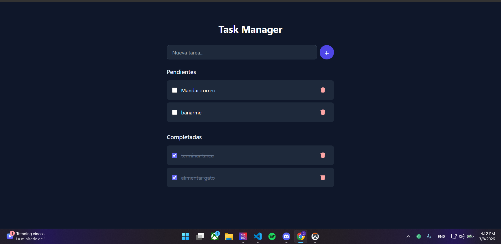

# 📝 Task Manager

Una aplicación de gestión de tareas que utiliza una API desarrollada en NestJS y hosteada en Railway para su fácil acceso.

---
## Deployemnt
https://front-end-eta-amber.vercel.app/

## Características 

* **Gestión CRUD Completa:** Crea, visualiza, edita y elimina tareas en tiempo real.
* **Filtros de Estado:** Clasificación inteligente de tareas (Pendientes y Completadas).
* **Sincronización de Estado:** UI que actualiza la interfaz instantáneamente mientras el backend procesa la petición.

### Funcionalidad

* **Backend Robusto (NestJS):** * **Validación de Datos:** Uso de DTOs y `class-validator` para asegurar que la información sea íntegra.
    * **Arquitectura Modular:** Código escalable y organizado por módulos, controladores y servicios.
* **Manejo de Errores:** * **Feedback al Usuario:** Alertas si hay fallos en la red o en la base de datos.

* **Persistencia:** Sincronización constante entre el cliente y el servidor.

---

## Stack 🚀

* **Frontend:** HTML5, TailwindCSS, JavaScript / TypeScript.
* **Backend:** **NestJS**  con arquitectura modular.
* **API:** RESTful API con endpoints para operaciones CRUD.
* **Almacenamiento:** Base de Datos (PostgreSQL en Supabase) con TypeORM.

## Estructura de la API

La comunicación se realiza a través de los siguientes endpoints principales:

| Método | Endpoint | Descripción |
| :--- | :--- | :--- |
| **GET** | `/tasks` | Obtiene el listado de todas las tareas. |
| **POST** | `/tasks` | Crea una nueva tarea (Requiere Body con el titulo). |
| **PATCH** | `/tasks/:id` | Actualiza el estado o contenido de una tarea. |
| **DELETE** | `/tasks/:id` | Elimina permanentemente una tarea. |

---

## Vista previa

